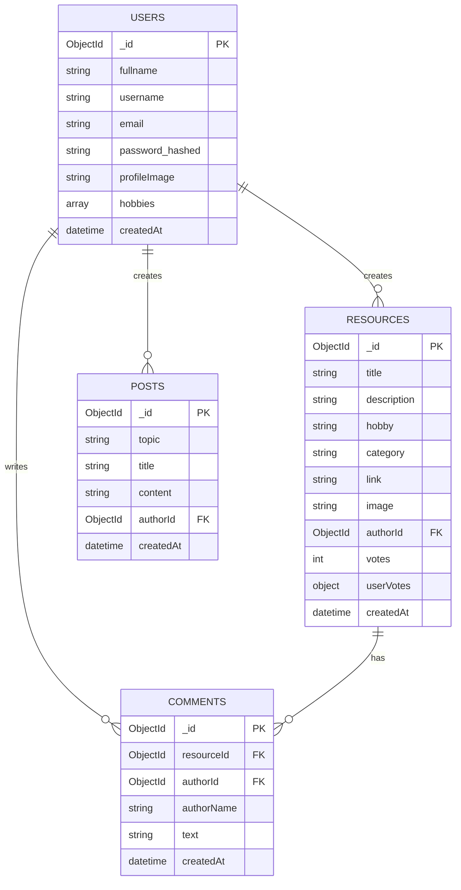

# 1. Project Overview and Stack

## Choice of Tech Stack

## Factors in Choosing a Tech Stack
When choosing a technology stack for a project, several factors come into play that can influence the decision-making process. Here's a breakdown of some of the key factors I will consider consider:

**1. Size and Scope of the Project**
- **Small Projects** (websites, simple applications): A simpler stack with fewer layers, like a static site generator or a WordPress site for a blog.
- **Medium Projects** (small to medium-sized business applications): Might require a more structured backend, possibly using frameworks like Django or Ruby on Rails.
- **Large Projects** (enterprise-level applications): Need robust solutions that can handle complex business logic, large databases, high concurrency, and scalability, such as Java EE, .NET, or a microservices architecture.

**2. Team Expertise and Resources**
- **Current Skills**: Choose a stack that aligns with the current skills of the development team to avoid a steep learning curve and ensure a smooth development process.
- **Learning Curve**: If adopting a new technology, consider the time required for the team to become proficient.
- **Availability of Developers**: Consider how easy it will be to hire for the stack now and in the future.

**3. Scalability**
- **Vertical Scalability**: Can you add more resources to the existing infrastructure easily?
- **Horizontal Scalability**: Can you add more machines or instances to balance the load?
- **Elasticity**: How well can the system accommodate significant fluctuations in usage?

**4. Maintainability**
- **Codebase Complexity**: More complex stacks can lead to a more complex codebase, which can affect maintainability.
- **Documentation and Community Support**: Good documentation and community support can greatly improve maintainability.

**5. Cost**
- **Licensing Fees**: Certain technologies require licensing fees, which can increase project costs.
- **Hosting and Operational Costs**: Some stacks may be more expensive to host and operate than others, especially at scale.

**6. Security**
- **Built-in Features**: Some stacks come with built-in security features that others lack.
- **Vulnerabilities**: Consider the history of the stack's vulnerabilities and the community's responsiveness to patching them.

**7. Time to Market**
- **Development Speed**: Some stacks enable rapid development with features like hot reloading, extensive libraries, and frameworks.
- **Availability of Development Tools**: Availability of IDEs, debugging tools, and other development tools that can speed up the development process.

**8. Performance**
- **Speed and Efficiency**: Some tech stacks are optimized for CPU-intensive tasks, while others are better for IO-intensive tasks.
- **Front-end Performance**: The stack should be capable of building responsive and fast user interfaces.

**9. Future Proofing**
- **Technology Trends**: Is the technology stack modern and likely to be supported for the foreseeable future?
- **Upgradability**: Consider how easy it is to update or upgrade the system components of the stack.

**10. Ecosystem**
- **Libraries and Frameworks**: A rich set of libraries and frameworks can speed up development and provide solutions to common problems.
- **Integration Capabilities**: The ability to integrate with other services and systems is crucial for most modern applications.

**11. Compatibility**
- **Existing Systems**: The new stack should be compatible with the company's existing technological infrastructure.
- **Third-party Services**: It should also be compatible with any third-party services or APIs the project intends to use.

With this in mind, I have chosen a tech stack of;

### Frontend
HTML5  
CSS3  
Javascript  
*- As a foundation for building the webpage*

Bootstrap 5 *(Bootstrap Team, 2024)*  
*- To build a responive UI from pre-built components (Easy to use)*

### Back-End
- Python *(Python Software Foundation, 2019)*
- Flask *(Flask, 2010)*

## Database:
- MongoDB *(MongoDB, 2019)*

## Authentication:
- Werkzeuk *(Pallets, 2024)*
- Flask *(Flask, 2010)*

### Version Control
Git + GitHub Classroom Repo – *See **Below***
https://github.com/ChristianDickinson76/TechStackAssessment2
(Github. (2013). GitHub. GitHub. https://github.com)

## Project Overview/Goal

**Create a platform on which users are able to share passions, hobbies and skills with like-minded learners. I will develop the frontend and the backend.**

The site will have sections in which users can sign up, log in and manage their accounts. They will also be able to upload and update profile pictures.
They will be able to provide their hobbies and skills to the site, view 'About Us' and 'Contact Us' pages, post resources, use basic search functionality to find resources or tools by keyword, and filter hobbies by category.

Users will will have a basic Upvote/Downvote system to rate resources, a simple comment system, and be able to view resources as a guest without signing in.

User's data will be stored in a database. This includes the details they have inputted, username and passwords (Which are hashed for security). Furthermore, resources will be saved in the database, including images, links, titles, description, upvotes and downvotes and comments.

## Real World Applications

This site is designed as an education social media in which users can share resources, categorised into different hobbies for easy searching. Users will come to the site if they are interested in discusssion and learning more about different hobbies, with learning driven by user engagement.

Similar sites include Reddit and Nebula.

| Feature | Skill Hub | Reddit | Nebula |
| --- | --- | --- | --- |
| Main purpose | A hobby-focused learning and resource sharing platform | A broad discussion and content-sharing platform | A creator-focused video and article platform |
| Content structure | Organised by hobbies and categories for easier discovery | Organised by subreddits and communities | Organised by creator channels and subscriptions |
| Interaction style | Users can post resources, comment, and vote on helpful content | Users can post, comment, upvote, and discuss a wide range of topics | Users mainly consume premium creator content with limited community interaction |
| Target audience | People learning hobbies, skills, and practical topics | General internet users interested in communities and discussion | Users looking for curated educational or long-form creator content |
| Moderation focus | Keeping hobby content relevant, safe, and useful | Community moderation at large scale across many topics | Creator-led content with platform quality control |
| Content discovery | Search and filter by hobby or topic | Search, subreddit browsing, and algorithmic feeds | Subscription-based discovery and recommendations |

Skill Hub offers a more focused and structured learning experience than Reddit or Nebula because it is designed specifically around hobbies, skills, and practical resource sharing. This makes it easier for users to find relevant content without sorting through unrelated discussions, while also creating a more welcoming environment for people who want to learn, contribute, and build knowledge within a clear topic area.

## Installation Instructions

1. Install prerequisites:
   1. Python 3.11+
   2. MongoDB Community Server (or MongoDB Atlas)
   3. Git
2. Clone the repository:
   - `git clone https://github.com/CS-LTU/com4113-tech-stack-assessment-1-2025-26-ChristianDickinson76.git`
3. Open the project folder.
4. Create and activate a virtual environment.
5. Install dependencies.
6. Create a `.env` file with required environment variables.
7. Start MongoDB.
8. Run the app with `python app.py`.
9. Open the app in a browser.

# Installation Instructions (Beginner Friendly)

## 1) Prerequisites (install these first)

1. **Git**
   Used to download (clone) the project repository.
   Download: https://git-scm.com/downloads

2. **Python 3.11 or newer**
   Used to run the Flask backend.
   Download: https://www.python.org/downloads/
   During install, tick **"Add Python to PATH"**.

3. **MongoDB** (choose one)
   - **MongoDB Community Server** (local database): https://www.mongodb.com/try/download/community
   - **MongoDB Atlas** (cloud database): https://www.mongodb.com/atlas

## 2) Clone the project

1. Open **VS Code**.
2. Open **Terminal** (`Ctrl + ``).
3. Run:

```bash
git clone https://github.com/CS-LTU/com4113-tech-stack-assessment-1-2025-26-ChristianDickinson76.git
cd com4113-tech-stack-assessment-1-2025-26-ChristianDickinson76
```

## 3) Create a virtual environment

A virtual environment keeps project packages separate from system Python.

```bash
python -m venv .venv
```

## 4) Activate the virtual environment

### Windows (PowerShell)
```powershell
.\.venv\Scripts\Activate.ps1
```

### Windows (Command Prompt)
```cmd
.venv\Scripts\activate.bat
```

### macOS / Linux
```bash
source .venv/bin/activate
```

When active, your terminal should show `(.venv)` at the start.

## 5) Install dependencies

If a `requirements.txt` file exists:

```bash
pip install -r requirements.txt
```

If not, install manually:

```bash
pip install flask pymongo python-dotenv werkzeug
```

### Dependency details
- `flask` → web framework (routes/pages/API)
- `pymongo` → MongoDB connection
- `python-dotenv` → loads environment variables from `.env`
- `werkzeug` → password hashing + file upload helpers

## 6) Create the `.env` file (project root)

Create a file named `.env` and add:

```env
SESSION_SECRET=replace_with_a_long_random_secret
MONGODB_URI=mongodb://localhost:27017
MONGODB_DB=skillhub
```

If using MongoDB Atlas, replace `MONGODB_URI` with your Atlas connection string.

## 7) Start MongoDB

If using local MongoDB on Windows:

```powershell
net start MongoDB
```

If using Atlas, ensure your cluster is running and network access is configured.

## 8) Run the app

```bash
python app.py
```

## 9) Open in browser

Go to:

- `http://127.0.0.1:3000/signIn`
- or `http://127.0.0.1:3000/signUp`

## 10) Common issues

1. **`ModuleNotFoundError`**
   Run:
   ```bash
   pip install <missing-package>
   ```

2. **PowerShell script execution blocked**
   Run PowerShell as admin once:
   ```powershell
   Set-ExecutionPolicy RemoteSigned
   ```

3. **MongoDB connection error**
   Check MongoDB is running, and `.env` URI is correct.

## Version Control

I shall be using Git for local version control, and pushing those local changes to the internet through GitHub. Git is a powerful tool that tracks all changes made to documents, and when they were made, while GitHub is an online service that stores files (And their derivative versions) in a remote server. These files can be downloaded, replicated, uploaded and modified at any point. This is extrememly useful as should the computer the files are stored locally on break, I will be able to recover those files from GitHub to a different computer in order to continue working.

### Commit Strategy and Use of Git

Git has been used throughout the project to track changes, manage versions, and provide a safe history of development. Each major change was committed separately with a meaningful commit message so that work could be reverted to if necessary.

My commit strategy was to make commits at key points in the projects development, such as updates to hobby pages, landing pages, backend features and bug fixes. This made it easier to identify what changed and when, and reduced the risk of losing work.

The repository for this assessment can be found [here.](https://github.com/CS-LTU/com4113-tech-stack-assessment-1-2025-26-ChristianDickinson76.git)

## Basic Legal and Ethical Review

-# Legal and Ethical

**GDPR Complience**
In order to comply with GDPR (GDPR. (2018). General Data Protection Regulation (GDPR). General Data Protection Regulation (GDPR). https://gdpr-info.eu), in the event of the website going live, I would ensure I only collected necessary data on individuals. This data may include;
- Fullnames
- Date of Birth
- Email address
- Profile picture
- Pronouns *if users permit it*
- Phone number *if users permit it*
- A profile on the users hobbies and interests.

This data would have to be kept secure, such as being encrypted on a remote server which requires authentication to access. Hashing is used for passwords as they are legally required not to be stored in plain text.

**Secure Handling of Data**
- In order to keep data secure, I would use encryption for user passwords, and HTTPS for secure transmission of webpages/communication.

**Use of Copyright**
- All images and resources used on the platform will have to go through a copyright check to ensure uploaders (Or the platform itself) owns the copyrights. This ensures the company does not leave itself vunerable to law suits.
- Disclaim any copyright belonging to the company. (UK Government. (2024, August 8). How copyright protects your work. GOV.UK. https://www.gov.uk/copyright)

**Accessability Adaptations**
- Include alt text on images for individuals who have visual impairments.
- Provide colour filter options for colour blind users.
- Language selection for users from different countries.
- Be able to use the app on mobile (I cannot test for this, however I have made provision for the site to adapt it's arrangment based on display size)

**Content Moderation**
- Outline a moderation policy for user generated content on the site.

## Risk Assessment

-# Risk Assessment

- Use secure channels of transmission (Such as HTTPS) for webpages.
- Use hashing and encryption when handling user login/personal details.
- In the event users lose/forget their login credentials, provide methods for users to recover their accounts, should they lose their credentials or lose the account to malicious individuals.
- Ensure all data is backed up through multiple formats to reduce risk of data loss.

- As an example of how I have secured the site, I have protected against SQL injection by using input validation in some input fields using html keywords


# 2. Technical Architecture and Replication

## Database Schema

This project uses **MongoDB (NoSQL)** with four main collections:

- **users**
  - Stores account and profile data.
  - Fields include: `_id`, `fullname`, `username`, `email`, `password` (hashed), `profileImage`, `hobbies`, `createdAt`.

- **resources**
  - Stores user-posted hobby resources.
  - Fields include: `_id`, `title`, `description`, `hobby`, `category`, `link`, `image`, `authorId`, `votes`, `userVotes`, `createdAt`.

- **comments**
  - Stores comments linked to resources.
  - Fields include: `_id`, `resourceId`, `authorId`, `authorName`, `text`, `createdAt`.

- **posts** (legacy/general content)
  - Fields include: `_id`, `topic`, `title`, `content`, `authorId`, `createdAt`.

**Why NoSQL (MongoDB):**
- Flexible document structure for evolving features.
- Faster iteration without rigid table migrations.
- Good fit for mixed data types (profiles, resources, comments, vote maps).

## Replication Guide

To replicate this project exactly:

1. Create a `.env` file in the project root:

```env
SESSION_SECRET=replace_with_a_long_random_secret
MONGODB_URI=mongodb://localhost:27017
MONGODB_DB=skillhub
```

2. Start MongoDB (local):
```powershell
net start MongoDB
```

3. Activate the virtual environment and install dependencies:
```powershell
.\.venv\Scripts\Activate.ps1
pip install -r requirements.txt
```

4. Seed test data:
```bash
python scripts/seed.py
```

5. Run the app:
```bash
python app.py
```

## Applied Risk Assessment

1. **Database connection failure**
   - **Risk:** App cannot read/write data.
   - **Mitigation in code:** Uses environment-based connection (`MONGODB_URI`), route-level error handling, and controlled API error responses.

2. **Invalid or malicious user input**
   - **Risk:** Broken data, unsafe links, invalid uploads.
   - **Mitigation in code:** Server-side validation (`validate_resource_form`), URL checks, required field checks, and `secure_filename` for uploads.

3. **Unauthorized access / data exposure**
   - **Risk:** Unauthenticated users accessing protected actions.
   - **Mitigation in code:** Session-based auth (`require_auth`) for protected routes and hashed passwords (`generate_password_hash`, `check_password_hash`).

4. **Unhandled application errors**
   - **Risk:** Crashes or broken user flow.
   - **Mitigation in code:** Custom `401/404/500` handlers for safe and consistent responses.

# 3. Rationale and Software Attributes

## Critical Comparison (Flask vs Django/Express)

-# Critical Comparison

Django and Flask are both web frameworks that allow for interaction with a central database from a seperate device over a network.

Django provides more built in features, while Flask takes more of a 'Do it yourself' attitude, giving full control over structure and components.

Django is a full stack web framework. This makes it most suited for large web applications. It has a Model-To-View architecture and a built in admin panel. It also offers many built in features to make web development easier. However, it also has a steeper learning curve.

Flask is a more open web framework with no architecture. Full control over the database is given to the developer, but few features are offered. It also has no built in control panel. In contrast to Django, it offers no default vulnerability protection. However, conversley to Django, it has an easier learning curve.

I decided to use Flask due to the easier learning curve. This made it easier for me to develop my web app. Due to the scale of the app, I did not face issues due to scale. However, I did have to add input validation to protect against some vulnerabilities.

## Good Software Attributes

-# Good Software Attributes

**Usability**
The interface must be intuitive and easy to navigate.
Responsive design for desktop and mobile (Bootstrap helps here).
Clear feedback for user actions (e.g., form validation messages).


**Maintainability**
- Modular, planned out code
- Consistent naming conventions for variables and functions.(Camelcase, local underscoring, etc)
- In-code documentation and comments for key components. (*See Below*)

**Security**
- Input validation
- HTTPS and encrypted passwords
- Hashing for login credentials.

**Accessibility**
- Follow WCAG guidelines *(World Wide Web Consortium [W3C], n.d.)*.
(https://www.w3.org/WAI/standards-guidelines/wcag/)
- Use semantic HTML and alt text for images.


## Legal and Ethical Rationale

**GDPR Complience**
In order to comply with GDPR (GDPR. (2018). General Data Protection Regulation (GDPR). General Data Protection Regulation (GDPR). https://gdpr-info.eu), in the event of the website going live, I would ensure I only collected necessary data on individuals. This data may include;
- Fullnames
- Date of Birth
- Email address
- Profile picture
- Pronouns *if users permit it*
- Phone number *if users permit it*
- A profile on the users hobbies and interests.

This data would have to be kept secure, such as being encrypted on a remote server which requires authentication to access. Hashing is used for passwords as they are legally required not to be stored in plain text.

**Secure Handling of Data**
- In order to keep data secure, I would use encryption for user passwords, and HTTPS for secure transmission of webpages/communication.

**Use of Copyright**
- All images and resources used on the platform will have to go through a copyright check to ensure uploaders (Or the platform itself) owns the copyrights. This ensures the company does not leave itself vunerable to law suits.
- Disclaim any copyright belonging to the company. (UK Government. (2024, August 8). How copyright protects your work. GOV.UK. https://www.gov.uk/copyright)

**Accessability Adaptations**
- Include alt text on images for individuals who have visual impairments.
- Provide colour filter options for colour blind users.
- Language selection for users from different countries.
- Be able to use the app on mobile (I cannot test for this, however I have made provision for the site to adapt it's arrangment based on display size)

**Content Moderation**
- Outline a moderation policy for user generated content on the site.

## Design, Security and Critical Reflection

## Data Protection

-# Data Protection

Password hashing is a legal necessity due to GDPR.

## Reflection on Challenges

-# Reflection on Challenges

The main hurdle I faced when connecting Flask to the database was getting my .env correctly set up.
Mainly the password and server link were hard to find, and I spent a long time troubleshooting my webpage seeming to 'hang' when I start it up. Another issue I faced was corruption of data when changing the layout and stored data of my database. Due to this, for a long while, my hobby pages would simply show 'Failed to fetch resources', until I finally fixed it by updating the respective flask routes.

## ERD / DMD Diagram

-## ERD / DMD (MongoDB Data Model)



## Mitigation Evidence (security measures implemented)

- As an example of how I have secured the site, I have protected against SQL injection by using input validation in some input fields using html keywords *(OWASP Foundation, 2021)*  


# 5. In‑Code Documentation

## Frontend Functions

-# In-code documentation for key functions and components

## Profile Picture Management

### `loadProfilePicture()`
Load saved profile picture from localStorage and display it in the header.

This function retrieves the user's profile picture from browser localStorage and updates the header profile image element if it exists on the current page.

### `initSignUpPreview()`
Initialize profile picture preview on sign-up page.

Handles the file upload functionality on the sign-up page, allowing users to preview their selected profile picture before submission. Uses FileReader API to convert the image to a base64 data URL.

### `initProfilePageUpload()`
Initialize profile page upload functionality.

Manages profile picture upload on the user's profile page. Allows users to select a new image, preview it, and save it to localStorage. The saved image persists across page reloads and is displayed in the header.

## Backend Routes and Helper Functions

-# In-code documentation for backend routes and MongoDB helper functions

## Flask Routes (used)

### Page Routes
- `GET /`
  Redirects to sign-in page.

- `GET /signin`, `GET /signup`, `GET /landing`, `GET /profile`, `GET /support`
  Serves core HTML pages.

- `GET /football`, `GET /coding`, `GET /cooking`, `GET /aitools`
  Serves hobby feed pages.

### Authentication and Account Routes
- `POST /signup`
  Validates sign-up form, hashes password, inserts user into `users`.

- `POST /signin`
  Validates login credentials against `users`, starts session.

- `GET /logout`
  Clears session and signs user out.

### Profile Routes
- `GET /api/profile`
  Returns current logged-in user profile data from `users`.

- `POST /profile`
  Updates profile fields and optional profile image in `users`.

- `POST /profile/delete`
  Deletes current user account from `users`.

### Resource and Comment API Routes
- `GET /api/resources/<hobby>`
  Returns resource feed for a hobby from `resources` (supports search query).

- `POST /api/resources/create`
  Creates a new resource with title/description/link/image in `resources`.

- `POST /api/resources/<resource_id>/vote`
  Updates vote state (`votes`, `userVotes`) in `resources`.

- `GET /api/resources/<resource_id>`
  Returns one resource document by ID.

- `GET /api/resources/<resource_id>/comments`
  Returns all comments for a resource from `comments`.

- `POST /api/resources/<resource_id>/comments`
  Inserts a new comment into `comments`.

### Utility / Error Routes
- `GET /uploads/<filename>`
  Serves uploaded files.

- Error handlers: `401`, `404`, `500`
  Returns API JSON errors or page templates depending on request type.

## MongoDB Helper Functions (used)

### `validate_resource_form(form, files)`
Validates resource input before DB insert.
Checks required fields, link format, and upload validity.

### `is_valid_http_url(value)`
Validates URL structure (http/https + hostname) before saving links.

### `allowed_file(filename)`
Validates uploaded file extension against allowed image types.

### `require_auth(api=False)`
Protects authenticated routes before DB reads/writes.

## MongoDB Collections and Data Handling

### `users`
Used for account creation, login lookup, profile read/update, and account deletion.

### `resources`
Used for hobby feed queries, resource creation, and voting updates.

### `comments`
Used for retrieving and posting resource comments.

### `posts` (legacy/general)
Used for topic-based post creation and retrieval where applicable.

# 6. Generative AI Disclosure

## Required AI usage statement

-# Generative AI Statement

Some Generative AI is used for creating the search, upvote and comment functions.
This saved time when first making the frontend, due to a tight schedule. Furthermore, Generative AI is used to develop database features of the site. Additionally, online resources such as WSchools are used for assistance. (W3Schools. (2019). W3Schools Online Web Tutorials. W3schools.com. https://www.w3schools.com)

This assignment used generative AI to support development. All AI‑generated content was reviewed, adapted, and validated by the author.

## APA 7 References

Bootstrap Team. (2024). *Bootstrap documentation (v5.3)*. https://getbootstrap.com/docs/5.3/

Flask. (2010). *Welcome to Flask — Flask documentation*. Pallets. https://flask.palletsprojects.com/en/stable/

MongoDB. (2019). *The most popular database for modern apps*. https://www.mongodb.com

OWASP Foundation. (2021). *OWASP Top 10: The ten most critical web application security risks*. https://owasp.org/www-project-top-ten/

Pallets. (2024). *Werkzeug documentation (3.1.x)*. https://werkzeug.palletsprojects.com/en/stable/

Python Software Foundation. (2019, November 18). *Python.org*. https://www.python.org

W3Schools. (2019). *W3Schools online web tutorials*. https://www.w3schools.com

World Wide Web Consortium. (n.d.). *Web Content Accessibility Guidelines (WCAG) overview*. https://www.w3.org/WAI/standards-guidelines/wcag/

GitHub. (n.d.). *GitHub Copilot documentation*. https://docs.github.com/en/copilot

MongoDB, Inc. (n.d.). *PyMongo documentation*. https://pymongo.readthedocs.io/en/stable/

Saurabh Kumar. (n.d.). *python-dotenv documentation*. https://saurabh-kumar.com/python-dotenv/